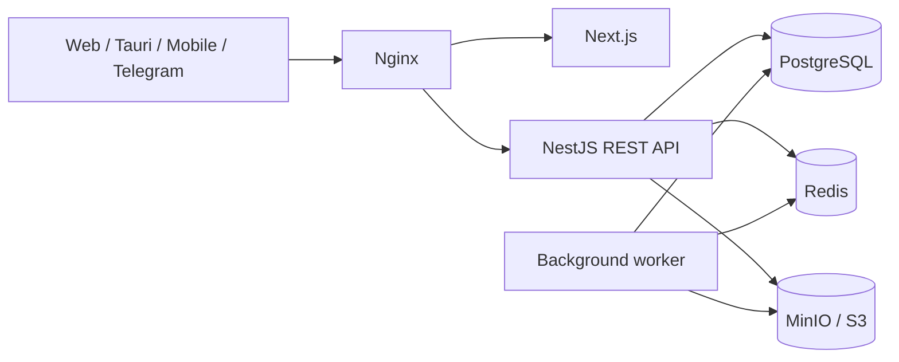

# ONA VA BOLA KLINIKASI — архитектура

## Цели

ONA VA BOLA KLINIKASI — API-first платформа управления частной клиникой. Веб-интерфейс, будущие приложения Tauri, React Native/Flutter и Telegram используют один версионированный REST API. Бизнес-правила находятся в backend, данные — в PostgreSQL, временное состояние и очереди — в Redis, документы — в приватном S3-хранилище.

## Контекст

## Монорепозиторий

- `apps/web` — Next.js App Router, только presentation и API orchestration.
- `apps/api` — Go HTTP API, авторизация, permission-based RBAC и бизнес-правила.
- `apps/api/migrations` — версионированные PostgreSQL migrations.
- будущий Go worker — Redis-backed фоновые задачи (этап 2).
- `packages/shared` — framework-independent DTO/schema/permissions.
- `infra` — Compose, Nginx и эксплуатационные файлы.

## Модульные границы

Первый вертикальный срез: identity, staff, patients, appointments, audit. Следующие bounded contexts: encounters/EMR, billing, inventory, laboratory, notifications, files and reporting. Связи между контекстами проходят через идентификаторы и сервисные интерфейсы; контроллеры не обращаются к Prisma напрямую.

## Tenancy и филиалы

Каждая бизнес-сущность содержит `organizationId`; приём также содержит `branchId`. Любой запрос исполняется в контексте организации из проверенного access token. Уникальные индексы включают tenant scope. Добавление филиалов не требует изменения API-контрактов.

## API

- Prefix `/api/v1`, JSON, UTC timestamps ISO-8601.
- OpenAPI доступен на `/api/docs` вне production или при явном включении.
- Access token короткоживущий; refresh token ротируется и хранится только в виде SHA-256 hash.
- Ошибки имеют стабильный HTTP status и NestJS JSON shape.
- Pagination: `page`, `pageSize`; поиск нормализуется на сервере.

## Решения

1. PostgreSQL — источник истины; Redis не содержит невосстановимых медицинских данных.
2. Soft delete для пациентов (`archivedAt`), immutable audit trail для значимых операций.
3. Доступ к PostgreSQL выполняется через `pgx`; критические запросы явно видны и параметризованы. Денежные значения — integer minor units, даты — `timestamptz`/UTC.
4. Файлы доступны только через backend-authorized presigned URLs; public bucket запрещён.
5. Миграции выполняются отдельной deployment-задачей до старта новых инстансов API.
6. Контекст `inpatient` хранит палаты и койки раздельно. Бронирование фиксирует цену на момент создания; пересечение активных интервалов одной койки блокируется exclusion constraint PostgreSQL, а отключение палаты/койки запрещено при будущей или текущей активной брони.

## Нефункциональные требования

## Электронная очередь

Модуль очереди является отдельным bounded context в Go API. `queue_entries` ссылается на существующие UUID пациента, записи, врача и филиала, не дублируя справочники. Номер выдаётся транзакционно под advisory lock в границах филиала, даты и области очереди. PostgreSQL остаётся источником истины; Redis используется только как транспорт событий. Публичный TV Display — отдельный Next.js route `/display/{token}` с SSE-подключением и периодической сверкой состояния. Медиа хранится через локальный storage adapter в выделенном volume; контракт допускает последующую замену на S3/MinIO.

- Горизонтально масштабируемый stateless API.
- Health/readiness endpoints, structured logs без PII, correlation id.
- Защита от конфликтующих приёмов транзакцией и DB constraint/проверкой.
- RPO/RTO и регламент backup/restore уточняются до production rollout.
