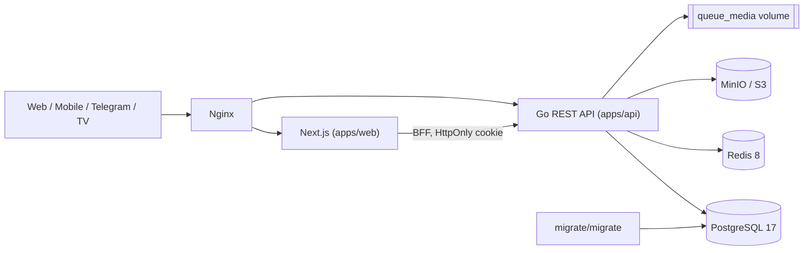
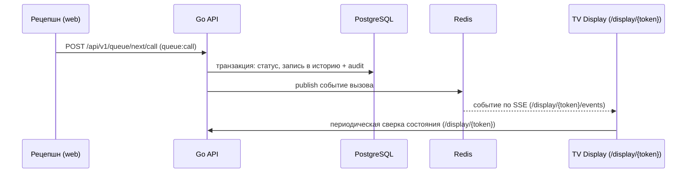

# Системная архитектура

**Проект**: ONA VA BOLA KLINIKASI (`clinicos`)
**Обновлено**: 2026-08-21

## Обзор

`clinicos` — API-first платформа управления частной клиникой. Единый
версионированный REST API (`/api/v1`) обслуживает веб-панель, будущие мобильное и
Telegram-приложения и публичные ТВ-экраны очереди. Бизнес-правила — в Go-бэкенде,
источник истины — PostgreSQL, транспорт realtime-событий — Redis, файлы —
приватное S3-совместимое хранилище (MinIO).

Данный документ отражает архитектуру по коду. Каноничный источник решений —
`ARCHITECTURE.md` в корне; расхождения вынесены в раздел «Открытые вопросы».

## Топология (Docker Compose)

Сервисы `compose.yaml`: `postgres`, `redis`, `migrate` (разовый, до старта API),
`minio`, `queue-media-init` (готовит volume), `api`, `web`, `nginx`, `seed`
(профиль `tools`). Все — в приватной сети `private`; наружу открыт только Nginx
(порт `80`).

## Слои Go API (`apps/api`)

Сборка приложения — `internal/app/app.go`: создаётся пул `pgx` к PostgreSQL,
клиент `go-redis`, auth-сервис. Слои:

1. **Транспорт / роутинг** (`internal/app/http.go`)
   - Роутер `chi`, префикс `/api/v1`.
   - Middleware: `recoverer` → `requestID` (`X-Request-ID`) → `securityHeaders`
     (`X-Content-Type-Options: nosniff`, `Referrer-Policy: no-referrer`,
     `Cache-Control: no-store`).
   - Health: `GET /api/v1/health/live` (живость) и `/health/ready` (пингует
     PostgreSQL и Redis, `503` при недоступности зависимостей).
   - Публичные маршруты: `auth/login`, `auth/refresh` и ТВ-очередь
     `display/{token}`, `display/{token}/events` (SSE), `display/{token}/media/{id}`.
   - Остальные маршруты — в группе за `authenticate` + `require("<permission>")`.

2. **Аутентификация и авторизация** (`internal/auth`)
   - Пароли — Argon2id (`password.go`).
   - `service.go`: выпуск/проверка JWT, principal с набором permissions.
   - `authenticate` извлекает Bearer-токен, кладёт principal в контекст;
     `require` проверяет наличие конкретного permission (deny-by-default).

3. **Доменные хендлеры** (`internal/app/*.go`)
   - По одному файлу на домен: пациенты, приёмы, клиника, лаборатория, диагнозы,
     услуги, стационар, склад, касса, бухгалтерия, отчёты, сообщения, очередь,
     медиа очереди, шаблоны документов, фото профилей, резервные копии, управление.
   - Каждый запрос исполняется в контексте организации из проверенного токена
     (tenant scope), запросы к PostgreSQL параметризованы.

## Модель permissions

Доступ — permission-based, deny-by-default. По роутеру используются домены:
`branches:*`, `employees:*`, `roles:*`, `patients:*`, `appointments:*`,
`clinical:*`, `specialists:*`, `inpatient:*`, `reports:read`, `finance:*`,
`inventory:*`, `queue:{read,manage,call,settings,display,media}`, `messages:*`,
`audit:read`, `backup:export`, `services:*`. Владелец (`OWNER`) имеет wildcard `*`.
Системные роли и их наборы permissions задаются в `cmd/seed`.

## Данные

### PostgreSQL — источник истины
- Схема управляется версионированными миграциями (`apps/api/migrations`,
  38 версий). Применяются сервисом `migrate` отдельной задачей до старта API —
  инстансы API не мигрируют схему сами.
- Каждая бизнес-сущность несёт `organization_id`; приёмы/касса/стационар —
  дополнительно `branch_id`. Уникальные индексы включают tenant scope.
- **State + immutable history**: текущее состояние и неизменяемая хронология
  разделены. Клинические визиты, диагнозы, история вызовов очереди не
  перезаписываются — добавляется новая запись; значимые изменения дублируются в
  `audit_logs` (append-only).
- Целостность на уровне БД: пересечение приёмов одного врача и пересечение
  активной брони одной койки запрещены constraint'ами PostgreSQL.
- Чувствительные поля шифруются `pgcrypto`; телефон дедуплицируется по
  необратимому хешу.

### Redis — транспорт событий
- Pub/Sub доставляет события электронной очереди на ТВ-экраны.
- Также используется для лимитирования (например, блокировка при подборе пароля).
- Redis **не** содержит невосстановимых медицинских данных — только временное
  состояние и транспорт.

### MinIO / S3 и локальное медиа
- Приватный бакет; публичных объектов нет. Полноценный файловый модуль с
  presigned URL, валидацией и антивирусом — в планах (этап 3).
- Медиа электронной очереди сейчас хранится в отдельном Docker volume
  `queue_media` (метаданные и путь — в PostgreSQL). Контракт допускает замену
  storage adapter на S3/MinIO без изменения API и таблицы метаданных.

## Поток данных: электронная очередь

PostgreSQL остаётся источником истины; Redis — только транспорт. Публичный экран
открывается по длинному случайному токену (в БД хранится SHA-256 hash), при разрыве
SSE восстанавливается периодической сверкой. Подробности и эксплуатация —
`docs/deployment/ELECTRONIC-QUEUE.md`.

## Веб-панель и BFF

Next.js (`apps/web`) отвечает за presentation и оркестрацию API. Аутентификация —
через BFF-слой `src/app/api/session/*` с HttpOnly, `SameSite=Strict` cookies;
`src/app/api/clinic/*` проксирует защищённые эндпоинты. Публичный маршрут
`display/` и `api/display/[token]` обслуживают ТВ-очередь. Для production HTTPS
обязательно `COOKIE_SECURE=true`.

## Резервные копии медданных

Пользовательский экспорт `.ovbk` шифруется AES-256-GCM, ключ выводится Argon2id из
отдельного пароля, который сервер не сохраняет. Целостность проверяется утилитой
`cmd/backupcheck`. Автоматическое восстановление через веб намеренно запрещено.
Подробности — `docs/deployment/BACKUP-RESTORE.md`.

## Конфигурация окружения

Ключевые переменные (`.env.example`, читаются `internal/app/config.go` и
`compose.yaml`): `DATABASE_URL`, `REDIS_URL`, `JWT_ACCESS_SECRET`,
`JWT_REFRESH_SECRET` (оба ≥ 32 байт и разные), `CORS_ORIGINS`, `QUEUE_MEDIA_PATH`,
`QUEUE_DISPLAY_URL`, `COOKIE_SECURE`, `NEXT_PUBLIC_API_URL`, `DEFAULT_ORGANIZATION_ID`,
`SEED_OWNER_LOGIN`, `SEED_OWNER_PASSWORD`, `S3_ENDPOINT`, `S3_BUCKET`.

## Нефункциональные свойства

- Stateless API, горизонтально масштабируемый.
- Health/readiness эндпоинты, structured logs без PII, correlation id.
- Защита от конфликтующих приёмов транзакцией и DB-constraint.
- RPO/RTO и полный регламент backup/restore уточняются до production rollout
  (см. production gate в `docs/project-roadmap.md`).

## Связанные документы

- [Обзор продукта (PDR)](./project-overview-pdr.md)
- [Сводка кодовой базы](./codebase-summary.md)
- [Стандарты кода](./code-standards.md)
- Корень: `ARCHITECTURE.md`, `SECURITY.md`, `MOBILE_INTEGRATION_PLAN.md`
- Эксплуатация: `docs/deployment/ELECTRONIC-QUEUE.md`, `docs/deployment/BACKUP-RESTORE.md`

## Известные ограничения кода (сверено 2026-08-21)

Корневые доки (`ARCHITECTURE.md`, `SECURITY.md`, `ROADMAP.md`) приведены в
соответствие с кодом. Остаются фактические ограничения реализации:

1. `packages/shared` объявлен в `pnpm-workspace.yaml`, но каталог `packages/`
   сейчас пуст — общие DTO/permissions пока не выделены.
2. Go worker (Redis-backed) и notifications (SMS/email/Telegram, outbox) — не
   реализованы, план этапа 3.
3. TTL токенов захардкожены в `internal/app/config.go` (access 15 мин, refresh
   30 дней); env-переменные `ACCESS_TOKEN_TTL` / `REFRESH_TOKEN_TTL_DAYS` из
   `.env` пока не читаются (TODO).
</content>
